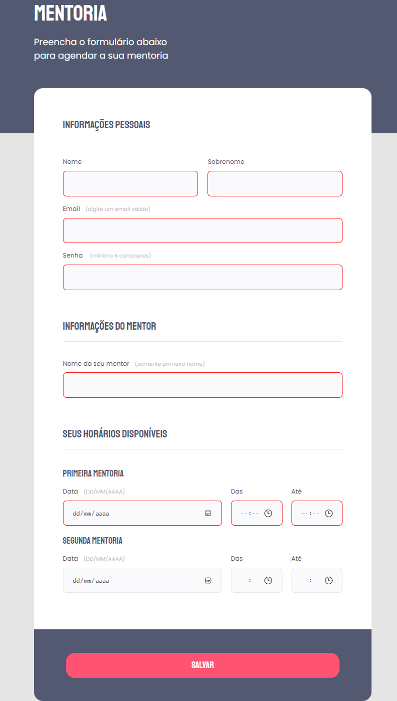

# Explorer - Projeto 04

> Projeto 04

Projeto desenvolvido durante o curso Explorer da Rocketseat, no último desafio do módulo Formulários, Validações e Customizações. Nesse desafio era preciso recriar um layout de formulário utilizando o que foi aprendido no curso.

[Clique aqui para acessar](https://henriquetho.github.io/projeto04-explorer/)

## Tecnologias

    - HTML
    - CSS

## Contato

- henrique.ribeirotho@gmail.com
- [LinkedIn](https://www.linkedin.com/in/henrique-thomazin-068922162/)
